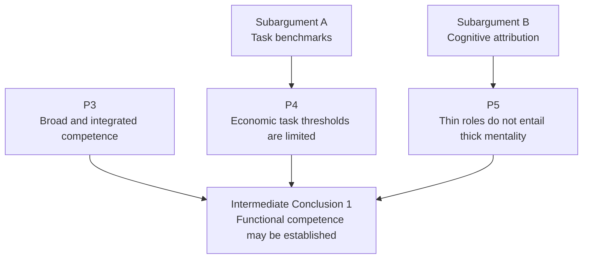
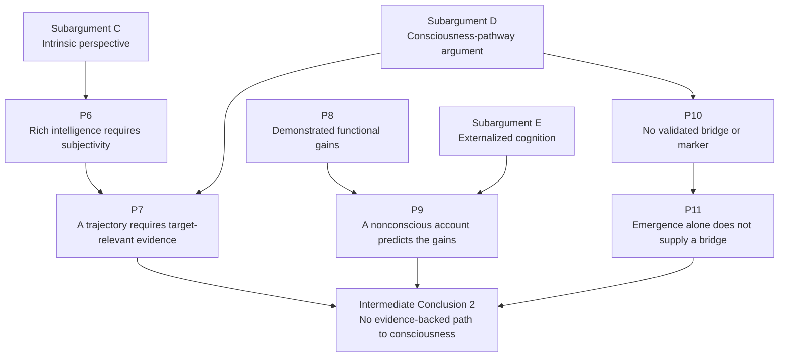
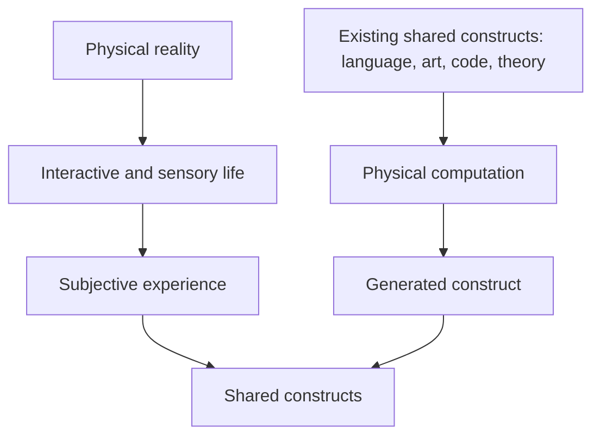

# The AGI Dilemma: Functional Competence and the Consciousness Gap

## Formal Argument Skeleton

Working video script: [AI Is Not Consciousness.md](AI%20Is%20Not%20Consciousness.md)

Production companion: [Clip Guide.md](Clip%20Guide.md)

This document states the argument in its academic form: a logical skeleton for later research and writing. The spoken draft lives in the linked video script. The main argument appears first; subordinate arguments then support its central premises.

## Thesis and scope

Claims that LLMs are approaching general intelligence depend on what "general intelligence" means. The term carries two common meanings, and each sets a different standard for the evidence.

On the first, *functional* conception, intelligence is a matter of what a system can do. A system counts as more generally intelligent as it succeeds across a wider range of tasks: writing, coding, planning, answering questions, using tools. By this standard, LLMs have plainly become more capable, and it is reasonable to describe them as making progress toward general intelligence.

Two features of this evidence limit what it shows. First, much of the work used to measure AI was standardized long before any model touched it: broken into procedures and scaffolded by tools, databases, interfaces, and institutional rules. A system can therefore succeed at a task while much of the relevant judgment lives in the surrounding institution. Second, the words used to describe AI output — *reasoning*, *judgment*, *understanding* — name what a system accomplishes, and they leave open a further question: whether meanings and reasons are present to the system, within a point of view it has.

The second, *consciousness-inclusive* conception makes that point of view part of the definition. On this account, an intelligent system has subjective experience: there is something it is like to be that system, and meanings, reasons, and alternatives are present to it.

This richer target raises the evidential bar. More computation, training data, memory, context, and tool use explain why a system behaves more capably. Showing that the system is approaching experience would require something further — a validated connection between those improvements and subjective experience, or a reliable way to tell a conscious system apart from a nonconscious one producing the same behavior. Currently we have neither.

The central claim is therefore limited but significant. Current evidence establishes increasingly broad functional competence, which may count as progress under the functional definition. Under the consciousness-inclusive definition, the same evidence leaves the richer target unaddressed, because the required connection between functional improvement and subjective experience has yet to be shown.

The conclusion is epistemic: it concerns what current definitions and evidence establish. Artificial consciousness may be possible, computation may turn out to participate in consciousness, and other theories of intelligence — built on embodiment, autonomy, persistent agency, or social participation — remain open. The claim defended here is narrow: evidence that a system can do more is one thing, evidence that there is something it is like to be that system is another, and current results supply only the first.

# I. Definitions

**Functional competence** is the capacity to perform tasks, produce appropriate outputs, solve problems, plan, or occupy some externally identifiable cognitive role.

**Functional general intelligence** is sufficiently broad and integrated functional competence, regardless of whether the system has subjective experience.

**Rich general intelligence** is broad and integrated intelligence that includes an intrinsic point of view. From that perspective, meanings, reasons, alternatives, goals, and experiences are present to the system itself.

**Minimal phenomenal consciousness** is the existence of subjective experience: there is something it is like for the system to undergo its states, and those states are present from a first-person perspective. This is distinct from wakefulness, responsiveness, information availability, access consciousness, and self-monitoring.

**Thin cognitive attribution** applies a cognitive term according to an observable or computational role. For example, a system may be said to judge because it ranks alternatives or to understand because it produces a contextually appropriate response.

**Thick cognitive attribution** applies a cognitive term in a subject-involving sense, implying that meanings, reasons, or alternatives are present to the system from its own point of view.

**Mental-state functionalism** is the philosophical thesis that possessing the appropriate causal or functional organization is sufficient for possessing the relevant mental state. Evidence of functional competence does not by itself commit someone to this philosophical thesis.

**Current LLM development** includes changes to parameters, training data, computation, context, memory, tools, planning mechanisms, architecture, and external support, primarily evaluated through functional performance.

**An established pathway** is a developmental process for which justified evidence connects changes in the process to the property supposedly being approached. A complete theory is unnecessary, but some reliable causal or evidential bridge is required.

**Construct validity** concerns whether a test actually measures the property it is used to represent. A benchmark can reliably measure task performance while remaining an incomplete measure of general intelligence.

# II. Master Argument

**P1.** Any justified claim that an LLM possesses or is approaching general intelligence requires a criterion specifying the target property.

**P2.** The claims examined here use *general intelligence* in either a functional sense, exhausted by sufficiently broad and integrated functional competence, or a consciousness-inclusive sense, which additionally requires an intrinsic subjective perspective.

## Branch One: Functional general intelligence

**P3.** Reliable evidence that an LLM possesses sufficiently broad and integrated task competence can establish general intelligence in the stipulated functional sense.

**P4.** The evidential value of economic task thresholds is limited by the extent to which the relevant tasks have already been standardized, decomposed, institutionally supported, and made machine-legible.

**P5.** Evidence that a system satisfies thin functional descriptions does not, without an independently defended bridge from functional organization to intrinsic mentality, entail the corresponding thick subject-involving properties.

P4 and P5 receive separate support:

1. **The Task-Benchmark Argument** supports P4 by examining benchmark endogeneity and construct validity.
2. **The Cognitive-Attribution Argument** supports P5 by distinguishing thin functional roles from thick subject-involving mental properties.

**Intermediate Conclusion 1.** Current LLM development can establish increasingly broad economic and functional competence. It establishes richer humanlike intelligence only through additional premises concerning the adequacy of task benchmarks and the sufficiency of functional organization.

## Branch Two: Consciousness-inclusive general intelligence

**P6.** Under a consciousness-inclusive conception, general intelligence requires a subjective perspective from which meanings, reasons, alternatives, or experiences are present to the system.

**P7.** Establishing that a developmental process approaches consciousness requires evidence connecting the dimensions being changed to conditions that produce or reliably track subjective experience.

**P8.** Current LLM development directly increases externally measurable capacities such as prediction, context use, memory, planning, tool use, linguistic coherence, and problem solving.

**P9.** These improvements are expected under a nonconscious explanation involving changes in computation, training, architecture, memory, tools, and external support.

**P10.** No currently established causal theory, measurement procedure, or discriminating body of evidence connects increases in these ordinary dimensions of LLM development to the production of phenomenal consciousness.

**P11.** Invoking *emergence* without supplying such a causal bridge, validated marker, or discriminating body of evidence does not establish that consciousness is present or being approached.

**Intermediate Conclusion 2.** Current LLM development has not established an evidence-backed pathway to phenomenal consciousness.

## Final Conclusion

**C.** Current evidence supports increasingly broad functional competence. Under a functional definition, that competence may qualify as progress toward general intelligence. Under a consciousness-inclusive definition, the same evidence does not establish richer general intelligence because no validated bridge from functional improvement to subjective experience has been supplied.

The argument does not deny that other nonfunctionalist accounts may propose different additional conditions. Its conclusion is limited to the functional and consciousness-inclusive claims examined here.

# III. Argument Roadmap and Dependency Maps

The original single diagram compressed the complete argument into one image. The following roadmap separates the two branches so that each supporting relationship can be followed independently.

**How to read the maps:** An arrow means *provides support for*, and most conclusions rest on several arrows working together.

## The whole argument at a glance

```text
P1. A justified AGI claim requires a defined target.
│
└── P2. This argument examines two conceptions of that target.
    │
    ├── ROUTE 1: FUNCTIONAL GENERAL INTELLIGENCE
    │   │
    │   ├── P3. Broad, integrated, reliable competence can satisfy
    │   │       the stipulated functional definition.
    │   │
    │   ├── Subargument A ──supports──> P4.
    │   │   Economic task thresholds have limited construct validity.
    │   │
    │   ├── Subargument B ──supports──> P5.
    │   │   Thin functional roles do not entail thick mental properties.
    │   │
    │   └── P3 + P4 + P5
    │            │
    │            └──> INTERMEDIATE CONCLUSION 1
    │                 Broad functional competence may be established;
    │                 richer humanlike intelligence requires more.
    │
    └── ROUTE 2: CONSCIOUSNESS-INCLUSIVE GENERAL INTELLIGENCE
        │
        ├── Subargument C ──supports──> P6.
        │   Rich intelligence includes a subjective perspective.
        │
        ├── P6 ──> P7.
        │   Approaching consciousness requires target-relevant evidence.
        │
        ├── P8 + Subargument E ──support──> P9.
        │   A nonconscious account already predicts the functional gains.
        │
        ├── Subargument D ──supports──> P7, P10, and P11.
        │   No validated bridge has been established, and merely invoking
        │   emergence does not provide one.
        │
        └── P6 + P7 + P8 + P9 + P10 + P11
                     │
                     └──> INTERMEDIATE CONCLUSION 2
                          No evidence-backed pathway to phenomenal
                          consciousness has been established.

INTERMEDIATE CONCLUSION 1 + INTERMEDIATE CONCLUSION 2
                         │
                         └──> FINAL CONCLUSION
                              Functional progress may be established;
                              consciousness-inclusive AGI remains unestablished.
```

## Route 1: Functional general intelligence



This branch asks two different questions:

1. **How broad is the demonstrated competence?** P3 concerns breadth, integration, reliability, and performance.
2. **What does that competence establish?** P4 challenges the neutrality of economic task thresholds, while P5 challenges the move from functional roles to subject-involving mental properties.

## Route 2: Consciousness-inclusive general intelligence



This branch asks a narrow question: are the dimensions improved by current LLM development known to produce or reliably track phenomenal consciousness? P7 states the evidential requirement, P9 supplies the nonconscious alternative explanation, and P10 and P11 identify the currently missing bridge. The possibility of artificial consciousness stays open throughout.

## Dependency index

| Supporting material | Directly supports | Role in the argument |
|---|---|---|
| **Subargument A: Task benchmarks** | **P4** | Shows why economic task thresholds are not neutral measures of richer intelligence. |
| **Subargument B: Cognitive attribution** | **P5** | Blocks an unsupported move from thin functional descriptions to thick mental properties. |
| **Subargument C: Rich intelligence and consciousness** | **P6** | Explains why the richer conception includes a subjective perspective. |
| **Subargument D: Consciousness pathway** | **P7, P10, P11** | States what a pathway to consciousness would require and why performance or emergence alone does not supply it. |
| **Subargument E: Externalized cognition** | **P9** | Supplies a nonconscious explanation for increasing linguistic and symbolic sophistication. |
| **P3 + P4 + P5** | **Intermediate Conclusion 1** | Establishes the scope and limits of the functional route. |
| **P6 + P7 + P8 + P9 + P10 + P11** | **Intermediate Conclusion 2** | Establishes the present evidential limits of the consciousness-inclusive route. |
| **Intermediate Conclusions 1 and 2** | **Final Conclusion** | Combines the results of the two conceptions examined. |

# IV. Subargument A: The Task-Benchmark Problem

This subargument supports P4.

**A1.** A benchmark is evidence of a general capacity only to the extent that success on it depends on that capacity rather than on features specific to the benchmark or its environment.

**A2.** Inventories of economically valuable human tasks are products of historically organized systems of labor rather than neutral samples of human intelligence.

**A3.** Many forms of modern labor have been decomposed, standardized, proceduralized, measured, and supported by institutional systems in order to reduce reliance on individual judgment and make workers more interchangeable.

**A4.** This process often transfers cognitive work from the individual worker into procedures, interfaces, management systems, databases, rules, and other forms of institutional organization.

**A5.** A machine can therefore perform a remaining standardized task without necessarily reproducing all the situated judgment, understanding, and autonomy involved in creating or organizing the system containing that task.

**A6.** The percentage of economically valuable tasks a machine can perform consequently measures both the machine's capacities and the degree to which the task environment has already been made machine-legible.

**Conclusion A.** The ability to automate a large percentage of human economic tasks is strong evidence of economic substitutability and functional breadth, but it is not by itself a sufficient or neutral measure of richer general intelligence.

The academic issue is **benchmark endogeneity** or **construct validity**, rather than strict circularity. The economy has helped create the standardized tasks on which the system is evaluated. The benchmark is therefore partly shaped by the same historical process that makes machine performance possible.

The argument requires only a modest claim: task-based thresholds are significantly influenced by how human institutions have organized the tasks being measured. Whether every occupation has been deskilled is a separate question, and the argument takes no position on it.

This empirical subargument will require evidence from the history and sociology of labor, including scientific management, deskilling, workflow standardization, modularization, institutional cognition, and the design of replaceable occupational roles.

# V. Subargument B: Observer-Relative Cognitive Attribution

This subargument supports P5.

**B1.** Terms such as *reasoning*, *judgment*, *understanding*, *interpretation*, and *decision making* can be used in at least two senses.

**B2.** In the thin functional sense, these terms identify observable or computational roles:

- ranking alternatives is called judgment;
- producing an inferential sequence is called reasoning;
- generating a contextually appropriate response is called understanding;
- selecting between possible outputs is called deciding.

**B3.** In the thicker subject-involving sense, these terms imply that alternatives, meanings, or reasons are present to a subject from its own point of view.

**B4.** LLM behavior directly provides evidence for thin functional descriptions.

**B5.** Evidence that a system satisfies a thin functional description does not logically entail that it possesses the corresponding thick, subject-involving property.

**B6.** Moving from the thin sense to the thick sense requires an additional premise. One example is the functionalist thesis that occupying the appropriate functional role is sufficient for possessing the mental state.

**B7.** Using the same cognitive vocabulary for both senses does not establish that functionalism is true.

**Conclusion B.** It can be legitimate to describe an LLM as reasoning, judging, or understanding in a functional sense while still lacking sufficient evidence that it reasons, judges, or understands in the same intrinsic sense as a conscious human subject.

Observer-relative attributions can be perfectly real: money, laws, offices, and games all have observer-relative properties. The risk is ambiguity, because shared cognitive vocabulary can conceal an unsupported inference from **functional resemblance** to **intrinsic mentality**.

A functionalist may respond that the relevant functional organization is sufficient for the mental property. That response identifies the precise theoretical disagreement, and settling it requires functionalism to be independently defended rather than assumed through the vocabulary used to describe the system.

# VI. Subargument C: Why the Richer Conception Involves Consciousness

This subargument supports P6.

**C1.** The richer conception of intelligence is intended to distinguish genuine possession of meanings, reasons, and judgments from the successful production of outputs that observers interpret in those terms.

**C2.** For meanings and reasons to be intrinsically present, rather than merely attributed from outside, there must be something to which they are present.

**C3.** The existence of a perspective to which things are present constitutes at least a minimal form of subjectivity or consciousness.

**Conclusion C.** A conception of intelligence involving intrinsic understanding, rather than only externally identifiable function, includes consciousness as a necessary condition.

This is one of the argument's central philosophical pressure points. A functionalist may reject C2 by arguing that the right functional organization is already sufficient for intrinsic understanding. The functionalist would then need to defend that bridging claim rather than infer it from successful behavior alone.

# VII. Subargument D: The Consciousness-Pathway Argument

This subargument supports P7 through P11.

**D1.** Evidence that a developmental process is approaching a property requires a justified relationship between the dimensions being changed and the property supposedly being approached.

**D2.** Current LLM development changes dimensions such as computational capacity, prediction accuracy, context length, memory, planning, tool use, architecture, external support, and task performance.

**D3.** These changes directly explain why a system might produce more coherent, adaptive, persuasive, and apparently autonomous behavior.

**D4.** They do not, without an additional bridging account, explain why there would begin to be something it is like to be that system.

**D5.** The observed functional improvements are expected under a nonconscious account in which changes to training, architecture, memory, tools, computation, and external support produce increasingly capable behavior.

**D6.** No independently validated marker, causal bridge, or evidential criterion has been supplied showing that these improvements are more diagnostic of consciousness than of nonconscious functional improvement.

**D7.** Evidence already explained under a nonconscious hypothesis, and lacking an independent consciousness marker, does not by itself establish consciousness.

**D8.** Calling consciousness *emergent* does not resolve the problem unless emergence identifies relevant organizational conditions, a causal mechanism, or evidence capable of discriminating between conscious and nonconscious systems.

**Conclusion D.** Increased performance through current LLM development does not currently establish either consciousness or an evidence-backed trajectory toward consciousness.

The requirement here is modest: a claimed technological pathway must provide some evidence connecting the technology to the property. Humans sometimes produce or recognize phenomena before possessing complete theories of them, so a complete solution to the philosophical problem of consciousness is unnecessary.

The bullet-train analogy illustrates the point: progress along one dimension counts toward a categorically different capacity only when the two dimensions are known to be connected. A train moving faster is not thereby approaching flight, and a model solving harder problems is not thereby shown to be approaching experience.

# VIII. Subargument E: The Externalization Argument

This subargument supports P9 by supplying a nonconscious explanation for sophisticated LLM behavior.

**E1.** Conscious human beings externalize products of cognition into language, mathematics, literature, theories, laws, software, institutions, and other symbolic systems.

**E2.** LLMs are trained extensively on these externalized products.

**E3.** A system can learn patterns in the products of a process without necessarily reproducing every property of the process that originally produced them.

**E4.** An LLM's ability to reorganize and reproduce the linguistic products of conscious cognition therefore does not independently establish that those products are present to the LLM as subjective experiences.

**E5.** This supplies an alternative explanation for apparent intelligence: the system has become increasingly capable of modeling the external traces of conscious cognition without necessarily becoming a conscious subject.

**Conclusion E.** Linguistic and symbolic sophistication cannot, by itself, discriminate between genuine subjectivity and increasingly powerful functional modeling of the products of subjectivity.

This argument establishes **underdetermination**: LLM outputs can be explained without assuming consciousness, so those outputs alone cannot prove consciousness. The question of whether LLMs are in fact conscious stays open.

## The four-layer form of the externalization argument

The alternative explanation can also be expressed through a layered account:

1. **Physical reality:** Mind-independent matter, energy, and physical processes exist and operate.
2. **Interactive and sensory life:** Living systems develop embodied, self-maintaining relations with physical reality through perception and action.
3. **Subjective experience:** Some living systems possess a first-person point of view; there is something it is like to undergo their processes.
4. **Shared constructs:** Conscious subjects externalize experience into language, mathematics, art, laws, institutions, theories, code, and other public symbolic systems.
5. **The LLM route:** LLMs are physical systems trained heavily on products of the fourth layer and transform encoded shared constructs into further shared constructs.



This framework locates the explanatory role of consciousness while leaving open how consciousness arises. Proving artificial consciousness impossible would require an additional premise showing that consciousness necessarily depends on biology, autonomous self-maintenance, embodiment, or another property absent from computational systems.

# IX. Logical Status of the Complete Argument

The skeleton has a mixed logical form. Its master structure is a scoped conceptual dilemma, while its subordinate arguments use several different modes of support:

1. P1 requires a defined target.
2. P2 specifies the two conceptions examined rather than claiming to exhaust every possible theory of intelligence.
3. P3 through P5 and Subarguments A and B establish the scope and limits of the functional route.
4. P6 through P11 and Subarguments C through E establish what the consciousness-inclusive route requires and why current functional evidence does not satisfy it.
5. Subargument A is historical and inductive.
6. Subargument B is conceptual and exposes a possible equivocation.
7. Subargument C depends on a philosophical account of intrinsic meaning and subjectivity.
8. Subargument D is evidential and partly abductive.
9. Subargument E supplies an alternative explanation and supports underdetermination.

The argument establishes conceptual underdetermination and epistemic insufficiency; the permanent impossibility of artificial consciousness lies beyond its scope.

The master inference can be deductively organized, but the soundness of the complete case depends on the quality of its conceptual, historical, empirical, and abductive support. Later research must therefore support several different kinds of premises:

- **Historical and empirical:** A2 through A6 concerning the organization and standardization of labor.
- **Conceptual and linguistic:** B1 through B7 concerning thin and thick uses of cognitive vocabulary.
- **Philosophical:** C1 through C3 concerning intrinsic meaning, subjectivity, and phenomenal consciousness.
- **Scientific and evidential:** P10 and D1 through D8 concerning what current LLM development changes and whether any validated bridge to phenomenal consciousness exists.

# X. Claims Intentionally Kept Outside the Proof

## Commercial and institutional incentives

AI companies, investors, and public figures may have incentives to describe ambiguous functional advances in the most historically significant and anthropomorphic terms available. This can help explain why stronger interpretations are promoted.

Using motives as proof would commit a genetic fallacy: incentives explain why an interpretation is promoted while leaving its truth undecided. The institutional argument should therefore remain separate:

- **Logical claim:** The offered evidence does not justify the strongest conclusions.
- **Sociological claim:** Institutions may have incentives to market functional gains as general intelligence, understanding, or consciousness.

## Permanent metaphysical impossibility

Claims that computation could never participate in consciousness, or that no artificial system could ever become conscious, require further metaphysical premises and stay outside the present case.

## What the argument concedes to functionalism

If someone explicitly defines general intelligence as broad functional competence, a system may genuinely qualify by that definition, and this argument leaves that result standing. The point is one of scope: satisfying a functional definition establishes functional competence, and consciousness, intrinsic understanding, and equivalence with human mentality each require further evidence.
