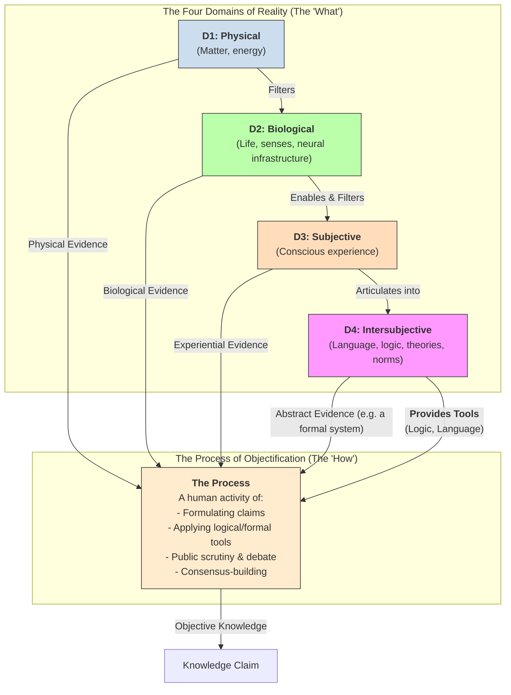

# 1. Introduction

I've always struggled to make sense of the diverse ways we come to know and understand the world. Initially, it seemed straightforward: I wanted to grasp why different fields, from physics to ethics, rely on distinct methods yet each claims its own form of objectivity. My first attempts, using a simple "four-layer" model, were a useful start but ultimately created a paradox: the final layer, the epistemic, was forced to act as both a source of evidence and the process of validation itself. The model felt clumsy.

The solution was not to discard the layers, but to understand them more precisely. This led to the framework that is the subject of this paper: a clear distinction between the **Domains of Reality (The 'What')** and the **Process of Objectification (The 'How')**.

This framework is built on two core ideas. First, there are four fundamental, filtering **Domains of Reality**:

*   **The Physical Domain (D1):** The bedrock of mind-independent matter, energy, and physical law.
*   **The Biological Domain (D2):** Living systems that emerge from D1. This realm *filters* our access to the physical; our senses and neural infrastructure dictate what we can perceive.
*   **The Subjective Domain (D3):** Conscious experience that emerges from D2. This is the final, personal lens of "what it's like" through which all information passes before it can be articulated.
*   **The Intersubjective Domain (D4):** The shared reality of abstract constructs. This is where language, logic, mathematics, theories, and social norms exist.

Second, there is the **Process of Objectification**. This is a separate, human activity that forges knowledge. This process draws evidence from any of the four domains, but it also uses tools—logic, language, mathematics—that are themselves part of the Intersubjective Domain. This resolves the original paradox by showing how one domain (D4) can be both a source of abstract evidence (e.g., for a logician) and the provider of tools for the validation process itself.

This model can be visualized as follows:

By separating the "what" from the "how," this framework provides an elegant map of knowledge. It honors the unique textures of reality—from atoms to consciousness to logic—while clarifying the shared, rigorous process by which we come to understand them. 