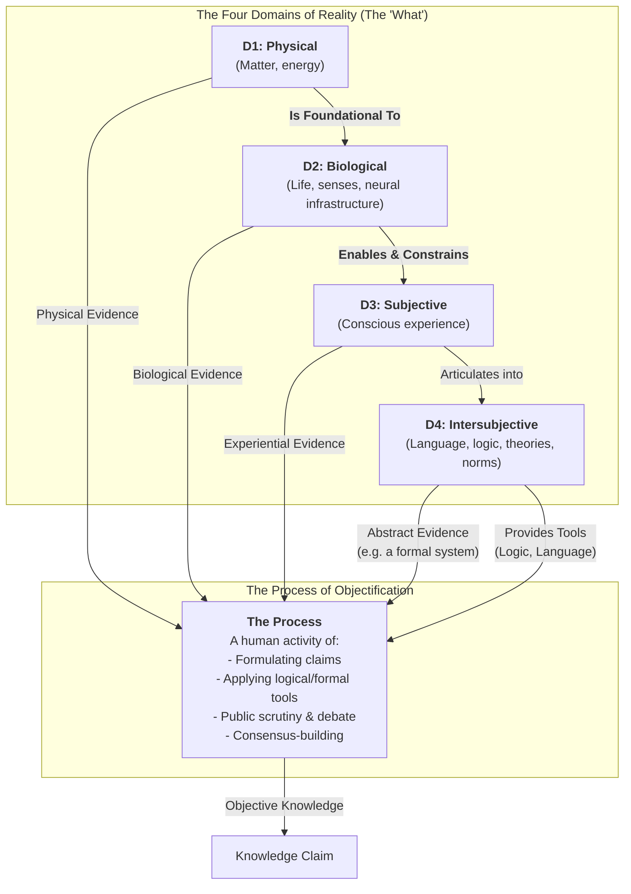

# 1. Introduction

I've always struggled to make sense of the diverse ways we come to know and understand the world. Initially, it seemed straightforward: I wanted to grasp why different fields, from physics to ethics, rely on distinct methods yet each claims its own form of objectivity. My first attempts, using a simple "four-layer" model, were a useful start but ultimately created a paradox: the final layer, the epistemic, was forced to act as both a source of evidence and the process of validation itself. The model felt clumsy.

The solution was not to discard the layers, but to understand them more precisely. This led to the framework that is the subject of this paper: a clear distinction between the **Domains of Reality (The 'What')** and the **Process of Objectification (The 'How')**.

This framework is built on two core ideas. First, there are four fundamental **Domains of Reality**, which relate to each other in a filtering, hierarchical structure:

*   **The Physical Domain (D1):** The bedrock of mind-independent matter, energy, and physical law. This is the domain of mountains, moles, and molecules. It is the foundation for all other domains.
*   **The Biological Domain (D2):** Arising from the physical, this is the domain of living systems. We study this domain differently than the physical, observing how organisms function. Critically, a key aspect of this domain is that it contains the biological faculties—senses, neural networks—that **enable and constrain** the potential for consciousness.
*   **The Subjective Domain (D3):** The first-person reality of conscious experience—the "what it's like" quality of seeing red, feeling joy, or perceiving a flowing river. This domain is profoundly shaped by the biological; a beetle, a bull, and a human experience the same physical river in vastly different ways because their biological makeup (D2) acts as a unique filter. While we can connect subjective reports to biological activity, a part of this experience remains, at present, irreducible.
*   **The Intersubjective Domain (D4):** The shared reality of abstract constructs that allow us to articulate and structure our thoughts. This is where language, logic, mathematics, theories, and cultural norms exist.

Second, there is the **Process of Objectification**. This is a separate, human activity that forges knowledge. This process can draw evidence from any of the four domains, but the standards of rigor change depending on the source. Empirical evidence is strongest when drawing from D1, while D3 relies more on coherence of reporting.

This model, visualized below, resolves the original paradox by showing how the Intersubjective Domain (D4) can be both a source of abstract evidence (e.g., for a logician studying formal systems) and the provider of essential tools (logic, language) for the objectification process itself.

By separating the "what" (the domains) from the "how" (the process), this framework provides an elegant map of knowledge. It honors the unique textures of reality—from atoms to consciousness to logic—while clarifying the shared, rigorous process by which we come to understand them. 

### Evolution Note (Added [Current Date])
Evolving from this first draft's domain structure:
- Refine Domain 2 (Biological) to highlight sensory mechanisms as enabling/constraining consciousness in Domain 3 (Subjective), with current irreducibility treated as contingent on future reduction.
- Add clarity on scope: Non-biological systems (e.g., AI) remain in Domain 1 unless they demonstrate living-like properties leading to experience.
- This preserves the framework's focus on objectification processes while tracking theoretical growth toward potential layer collapses. 