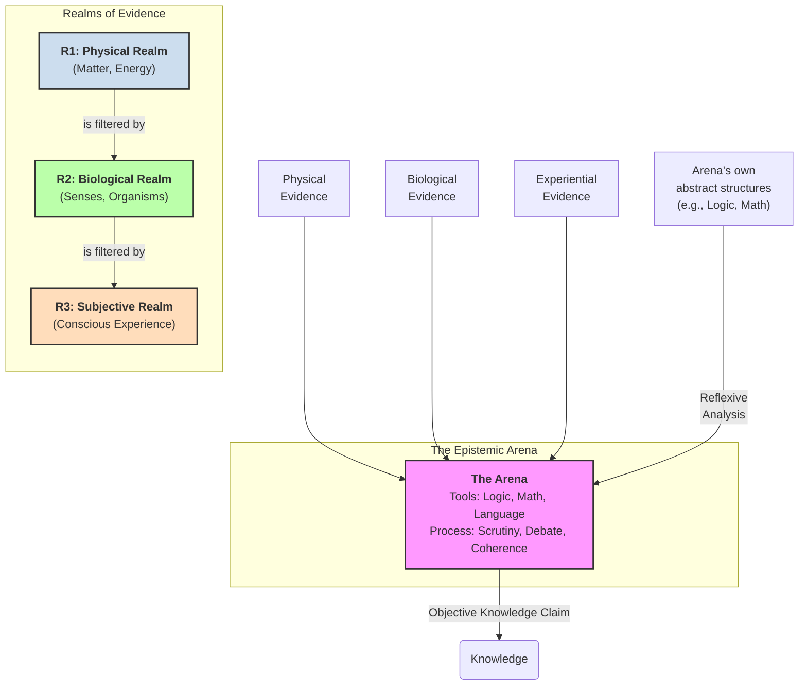

# 1. Introduction

I've always struggled to make sense of the diverse ways we come to know and understand the world. Initially, it seemed straightforward: I wanted to grasp why different fields, from physics to ethics, rely on distinct methods yet each claims its own form of objectivity. My first attempt was a four-layer framework, a vertical stack with the physical at the bottom, then the biological, the subjective, and finally the epistemic at the top. It was a useful start, highlighting how each layer depends on and filters the one below it.

But a critical paradox emerged, a flaw that made the model clumsy. The fourth layer, the "Epistemic," was doing two jobs at once. It was the arena where objectivity was forged, but it also acted as a source of evidence for fields like logic and mathematics. The moment I had to say, "Layer 4 is different; it's split into two parts," the elegance of the framework collapsed. A model is only as good as its clarity, and forcing a concept into a structure that doesn't quite fit is a recipe for confusion.

It was time for a new framework.

This paper scraps the "four-layer" name but carries forward the core concepts: the hierarchical filtering, the different evidence handles, and the single validation process. It resolves the paradox of the fourth layer by replacing the simple stack with a more robust model: **The Three Realms of Evidence and the Epistemic Arena.**

Instead of four co-equal layers, we have two fundamentally different kinds of things.

**Part 1: The Three Realms of Evidence (Where we get our data)**

This preserves the crucial insight about the hierarchical, filtering stack. These are the nested and dependent domains of reality itself.

*   **The Physical Realm:** The bedrock of mind-independent matter, energy, and physical law.
*   **The Biological Realm:** Living systems that emerge from the Physical Realm. This realm *filters* our access to the physical; our senses, brain structure, and evolutionary history dictate what we can and cannot perceive.
*   **The Subjective Realm:** Conscious experience that emerges from the Biological Realm. This is the final, personal lens through which all information passes before it can be articulated, containing our focus, biases, values, and the irreducible "what it's like" quality of experience.

**Part 2: The Epistemic Arena (Where we build knowledge)**

This is the special, constructed space where all claims are forged into objective knowledge. It stands apart from the realms of evidence and elegantly solves the paradox of the old Layer 4. The Arena has two facets:

1.  **A Set of Tools (The "Library"):** These are the abstract objects that exist within the Arena for us to use: formal logic, mathematics, language, scientific principles, and established theories.
2.  **A Validation Process (The "Forge"):** This is the active, human process of taking evidence from any of the three realms, applying the Arena's tools, and subjecting the resulting claims to public scrutiny, coherence checks, and peer review.

Crucially, the tools of the Arena can be turned upon themselves. A logician takes a tool (a logic system from the Library) and uses the Arena's *process* (the Forge) to analyze it, creating a new, objective claim (a proof or theorem). This explains why this domain can feel like a "source" of evidence without being a "Realm" in the same way as the others. It's a reflexive property of the Arena itself.

This new model can be visualized as follows:

This "Realms and Arena" framework keeps all the original insights but structures them in a way that is more precise, avoiding the "four-layer" problem. It's clean, it's elegant, and it honors the unique, dual role of the epistemic domain. It provides the map I was looking for—one that respects the different textures of reality without getting tangled up in its own definitions. 