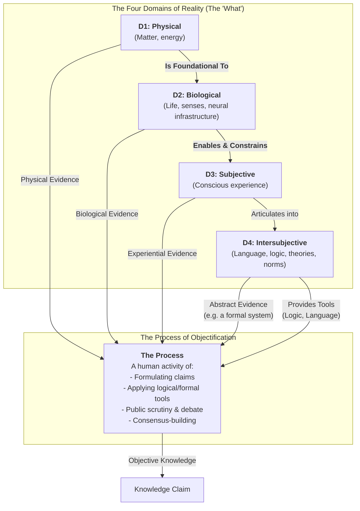

# Reality-in-Layers: The Goal is Elegant Clarity

## The "Why" of This Project

This project does not aim to invent new philosophical categories. The ideas of thinkers like John Searle and Karl Popper are powerful, but academic frameworks can often feel dense and clumsy when used as practical tools for communication.

The goal of this project is different. It is to create a framework that prioritizes **elegance and utility** over exhaustive philosophical rigor.

## Our Contribution: A Practical Map

This framework is a "workbench diagram" that separates the "what" from the "how" to allow for a more productive conversation.

**The "What": The Four Domains of Reality**
The map first identifies four fundamental domains from which we draw evidence, each filtering and enabling the others:
1.  **The Physical Domain:** The bedrock of mind-independent matter and energy.
2.  **The Biological Domain:** Living systems that are foundational to and constrain our experience.
3.  **The Subjective Domain:** The irreducible, first-person reality of "what it's like" to be a conscious being.
4.  **The Intersubjective Domain:** The shared reality of abstract constructs like language, logic, and culture.

**The "How": The Process of Objectification**
This is the separate, human activity where knowledge is forged. The process draws evidence from any of the four domains and uses the tools of the Intersubjective Domain (logic, language) to build claims that can withstand public scrutiny and consensus.

By clearly separating the domains of reality from the process of validation, this framework provides an elegant map that helps us understand why different fields have different methods, without ranking them in a hierarchy of "objectivity."

