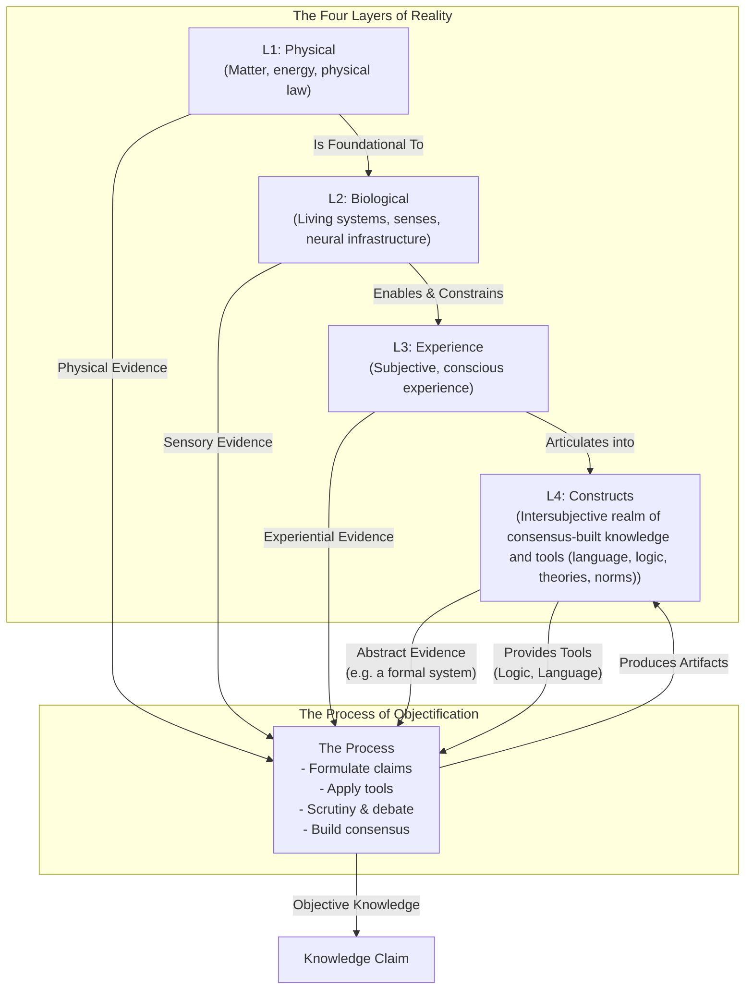

# Reality-in-Layers

**Note:** For the latest introduction, see [Second Draft/Introduction.md](Second Draft/Introduction.md).

## Purpose

This framework helps understand the different parts of reality and how we make those parts objective facts. There is a relationship here because the more we know how each can contribute to becoming facts (and how they cannot) and what the process differences are for each, the more we learn about them in turn.

## Structure

The framework distinguishes four layers of reality from the process of objectification.

**The Four Layers of Reality**
The four layers categorize where everything exists, each filtering and enabling the others:
1.  Layer 1: Physical – Matter, energy, physical law.
2.  Layer 2: Biological – Living systems, senses, neural infrastructure.
3.  Layer 3: Experience – Subjective, conscious experience.
4.  Layer 4: Constructs – Intersubjective realm of consensus-built knowledge and tools (language, logic, theories, norms).

**The Process of Objectification**
The process draws evidence from the layers, integrates across layers (e.g., biological insights into subjective theories), and produces artifacts in Layer 4. It uses tools from Layer 4 to formulate claims, conduct scrutiny, and build consensus.

The framework shows why fields use different methods and how objectivity works across layers.

