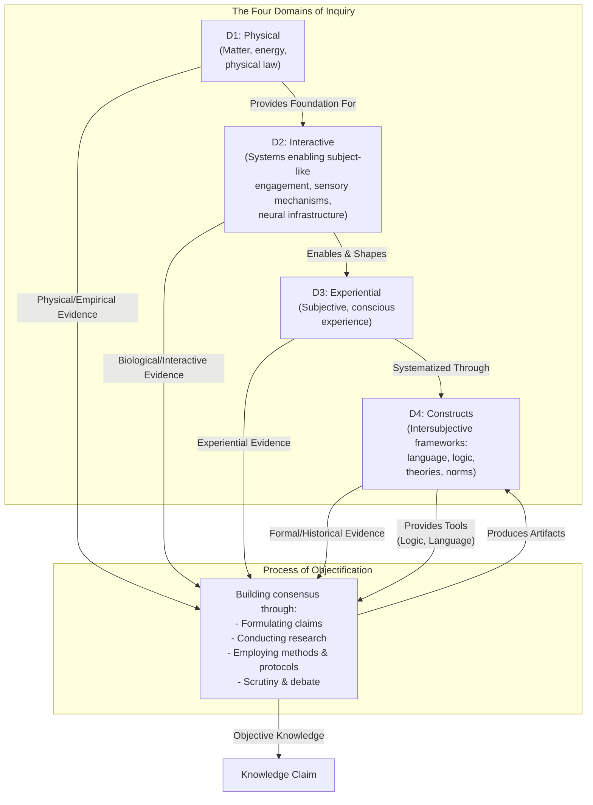

# Domains of Inquiry

**Note:** For the latest introduction, see [Third Draft/Introduction.md](Third Draft/Introduction.md).

## Purpose

This framework helps understand how different fields achieve objectivity through distinct types of evidence and methodological approaches. By organizing inquiry into four domains, we can see why physics, ethics, aesthetics, and other fields use radically different methods while each legitimately claiming to produce objective knowledge. Understanding how each domain contributes to knowledge building (and how they cannot) reveals the nature of objectivity itself.

## Structure

The framework distinguishes four domains of inquiry from the process of objectification.

**The Four Domains of Inquiry**
The four domains categorize how we organize evidence and methods, each building on and informing the others:
1. Domain 1: Physical – Mind-independent matter, energy, physical law.
2. Domain 2: Interactive – Systems enabling subject-like engagement, sensory mechanisms, neural infrastructure.
3. Domain 3: Experiential – Subjective, conscious experience.
4. Domain 4: Constructs – Intersubjective frameworks: language, logic, theories, norms.

**The Process of Objectification**
The process draws evidence from the domains, integrates across domains (biological insights can inform ethical theories, for example), and produces artifacts in Domain 4. It uses tools from Domain 4 to formulate claims, conduct scrutiny, and build consensus.

The framework shows why fields use different methods and how objectivity works across domains. The key insight: objectivity is domain-relative. Physics achieves objectivity through empirical correspondence with D1. Ethics achieves objectivity through coherent systematization of D3 intuitions informed by other domains. Neither approach is more or less objective; they are objective in different ways appropriate to their domains.

### Detailed Explanations

#### Domain Descriptions

* **Domain 1: Physical (D1):** The study of mind-independent matter, energy, and physical law. This domain covers mountains, molecules, and fundamental forces. It provides the foundation for understanding all other domains.
* **Domain 2: Interactive (D2):** The study of systems that detect and respond to environmental stimuli. While we understand this domain primarily through biological examples like sensory organs and neural networks, the domain is defined functionally. These systems do more than undergo physical causation; they actively engage with their environment in ways that enable and constrain the possibility of consciousness. A rock exists in D1; a system that detects light and converts it into signals interacts with D1.
* **Domain 3: Experiential (D3):** The study of first-person conscious experience, the subjective quality of seeing red, feeling joy, or perceiving a flowing river. This domain is profoundly shaped by D2 systems; a beetle, a bull, and a human experience the same physical river in vastly different ways because their interactive systems filter reality differently. For certain inquiries, particularly in ethics and aesthetics, first-person experience serves as the primary source of evidence. We currently treat this as a distinct domain of evidence, though this is contingent on methodological needs rather than ontological commitments.
* **Domain 4: Constructs (D4):** The study of collectively-held frameworks that allow us to articulate and structure understanding. This domain includes language, logic, mathematics, theories, and cultural norms. These constructs are intersubjective, meaning they depend on shared agreement and continuous refinement through discourse.

#### Process of Objectification
The Process of Objectification is the ongoing human activity that forges objective knowledge by drawing evidence from any of the four domains and producing shareable artifacts (theories, norms, frameworks) that reside in Domain 4. It builds consensus through steps like formulating claims (based on domain evidence), conducting research (gathering data), employing methods and protocols (logic, experiments, reflective analysis), and scrutiny and debate (public review and refinement). Standards of rigor vary by domain: empirical testing and measurement for D1, biological observation for D2, coherent systematization for D3, formal consistency for D4. The process allows cross-layer integration, so ethical theories can incorporate biological insights about harm or historical patterns of social organization. It uses tools from Domain 4 (like language and logic) and results in artifacts that feed back into Domain 4, enabling shared, objective knowledge.

## Repository Structure

- **Third Draft/**: Current working version with epistemological framing
- **Second Draft/**: Previous version emphasizing ontological layers
- **First Draft/**: Initial domain-based model
- **Initial Notes/**: Foundational concepts and early exploration

## Status

Active development. The framework continues to evolve through refinement of core concepts and clarification of methodological relationships between domains.
