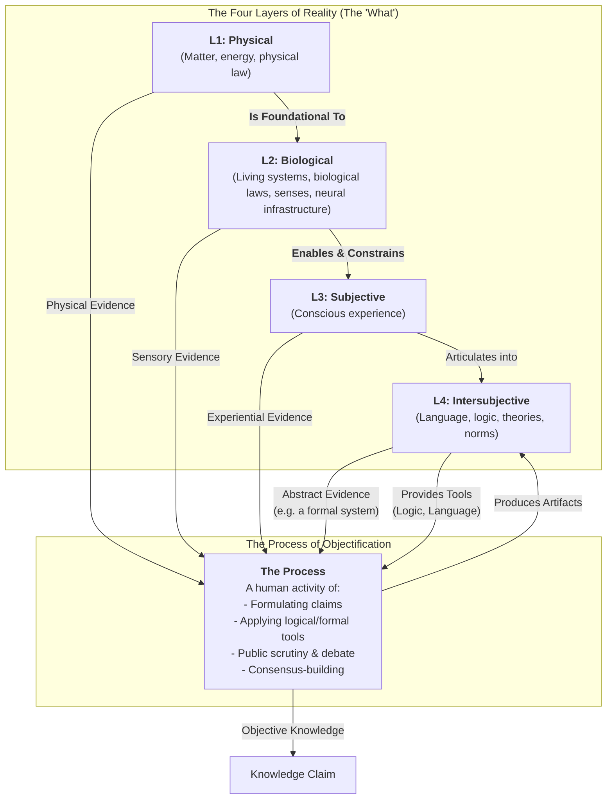

# Reality-in-Layers

## The "Why"

This project does not aim to invent new philosophical categories. The ideas of thinkers like John Searle and Karl Popper are powerful, but academic frameworks can often feel dense and clumsy when used as practical tools for communication.

The goal of this project is to create a framework that prioritizes **elegance and utility** over exhaustive philosophical rigor.

## Our Contribution: A Practical Map

This framework is a "workbench diagram" that separates the "what" from the "how" to allow for a more productive conversation.

**The "What": The Four Layers of Reality**
The map first identifies four fundamental, ontologically distinct layers of reality—realms that categorize where everything that exists resides—each filtering and enabling the others:
1.  **Layer 1: Physical (L1):** The bedrock of mind-independent matter and energy.
2.  **Layer 2: Biological (L2):** Living systems that are foundational to and constrain our experience.
3.  **Layer 3: Subjective (L3):** The irreducible, first-person reality of "what it's like" to be a conscious being.
4.  **Layer 4: Intersubjective (L4):** The shared reality of abstract constructs like language, logic, and culture.

**The "How": The Process of Objectification**
Separate from these layers, this is the human activity where knowledge is forged. The process draws evidence from any of the four layers, adapts tools based on each layer's unique texture (with flexibility for cross-layer integration, e.g., weaving biological insights into subjective moral theories), and produces shareable artifacts (e.g., theories, norms) that reside in Layer 4. It uses tools from Layer 4 (logic, language) to build claims that can withstand public scrutiny and consensus.

By clearly separating the ontologically distinct layers of reality from the cross-layer process of validation, this framework provides an elegant map that helps us understand why different fields have different methods, without ranking them in a hierarchy of "objectivity."

