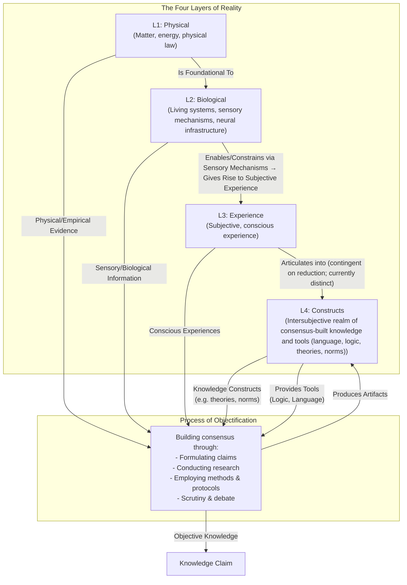

# Reality-in-Layers

**Note:** For the latest introduction, see [Second Draft/Introduction.md](Second Draft/Introduction.md).

## Purpose

This framework helps understand the different parts of reality and how we make those parts objective facts. There is a relationship here because the more we know how each can contribute to becoming facts (and how they cannot) and what the process differences are for each, the more we learn about them in turn.

## Structure

The framework distinguishes four layers of reality from the process of objectification.

**The Four Layers of Reality**
The four layers categorize where everything exists, each filtering and enabling the others:
1.  Layer 1: Physical – Matter, energy, physical law.
2.  Layer 2: Biological – Living systems, senses, neural infrastructure.
3.  Layer 3: Experience – Subjective, conscious experience.
4.  Layer 4: Constructs – Intersubjective realm of consensus-built knowledge and tools (language, logic, theories, norms).

**The Process of Objectification**
The process draws evidence from the layers, integrates across layers (e.g., biological insights into subjective theories), and produces artifacts in Layer 4. It uses tools from Layer 4 to formulate claims, conduct scrutiny, and build consensus.

The framework shows why fields use different methods and how objectivity works across layers.

### Layer Descriptions (Synced from Second Draft)

*   **Layer 1: Physical (L1):** The bedrock of mind-independent matter, energy, and physical law. This is the layer of mountains, moles, and molecules. It is the foundation for all other layers.
*   **Layer 2: Biological (L2):** This is the layer of living systems, encapsulating goal-directed functions such as homeostasis, metabolism, reproduction, and sensory transduction (processes that create a distinct type from the non-living entities in Layer 1, including anything else that qualifies as these functions). We study this layer differently than the physical, observing how organisms function. Critically, a key aspect of this layer is that it contains the biological faculties (sensory mechanisms, neural networks) that **enable, constrain, and determine** the potential for consciousness.
*   **Layer 3: Experience (L3):** The first-person reality of subjective conscious experience (the "what it's like" quality of seeing red, feeling joy, or perceiving a flowing river). This layer is profoundly shaped by the biological; a beetle, a bull, and a human experience the same physical river in vastly different ways because their biological makeup (L2) acts as a unique filter. While we can connect reports to biological activity, a part of this experience remains, at present, irreducible (contingent on future scientific reduction; currently treated as distinct for evidential purposes).
*   **Layer 4: Constructs (L4):** The shared reality of intersubjective constructs that allow us to articulate and structure our thoughts through consensus formation and social constructions. This is where language, logic, mathematics, theories, and cultural norms exist.
