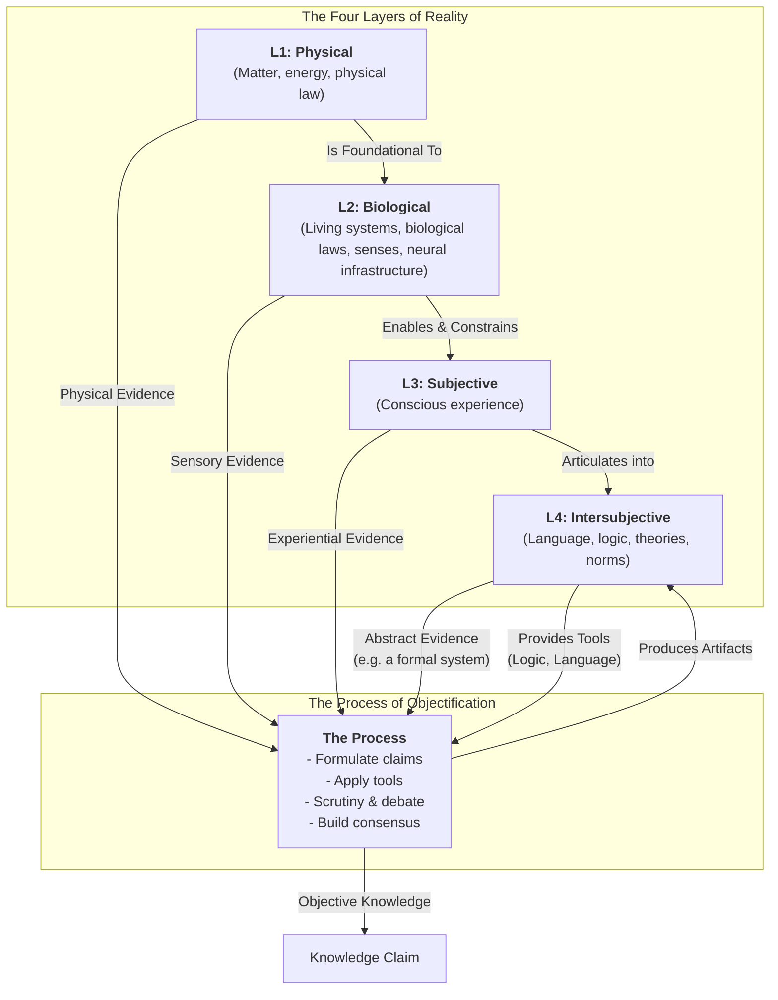

# Reality-in-Layers

**Note:** For the latest introduction, see [Second Draft/Introduction.md](Second Draft/Introduction.md).

## Why This Project Exists

This project develops a framework that maps reality into four ontological layers and separates the process of objectification to explain how we know and validate the world across different fields.

## The Framework

This framework distinguishes the four layers of reality from the process of objectification.

**The Four Layers of Reality**
The framework identifies four ontological layers that categorize where everything exists, each filtering and enabling the others:
1.  **Layer 1: Physical (L1):** Matter, energy, physical law.
2.  **Layer 2: Biological (L2):** Living systems, biological laws, senses, neural infrastructure.
3.  **Layer 3: Subjective (L3):** Conscious experience.
4.  **Layer 4: Intersubjective (L4):** Language, logic, theories, norms.

**The Process of Objectification**
This process draws evidence from the four layers, integrates across layers (e.g., biological insights into subjective theories), and produces artifacts that reside in Layer 4. It uses tools from Layer 4 to formulate claims, conduct scrutiny, and build consensus.

This framework shows why fields use different methods and how objectivity works across layers.

