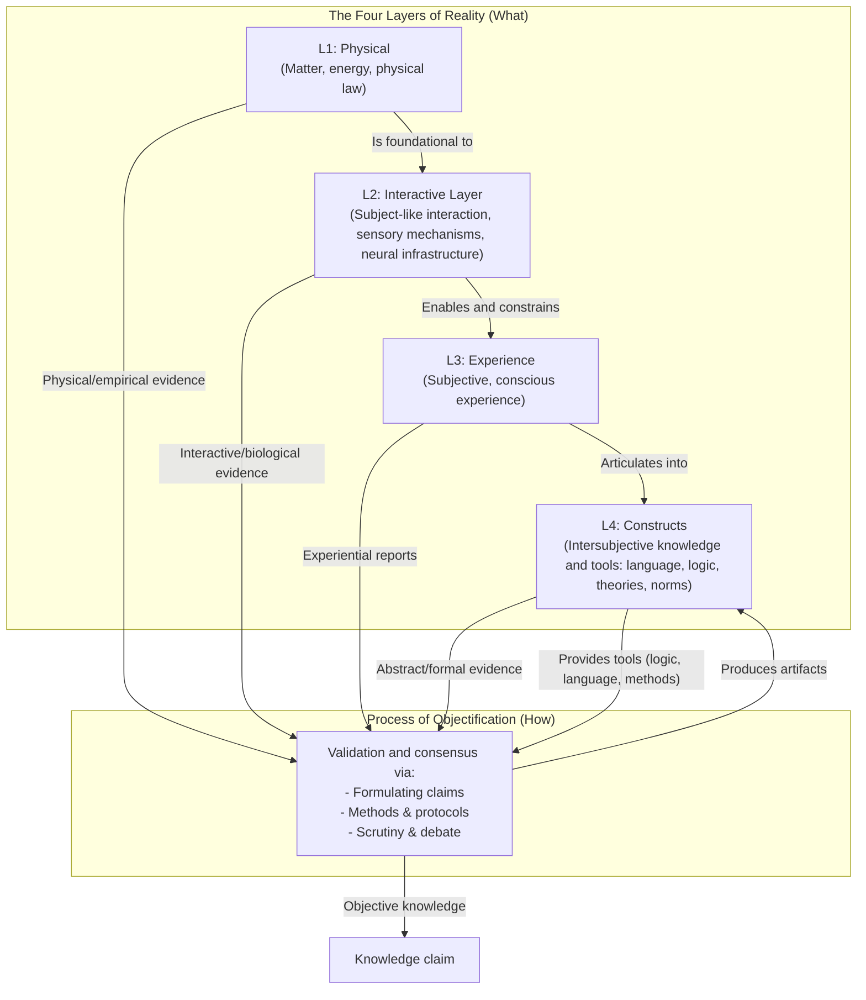

# 1. Introduction

We use very different methods to make claims in physics, psychology, and ethics—yet each aspires to objectivity. This project offers a simple map for why that works: there is one validation process that produces objective claims, and it operates on different kinds of evidence sourced from distinct layers of reality. I first outline those layers, then show how the single validation gate evaluates claims with the right tools for the job.

## The Four Layers of Reality (the “What”)

- **Layer 1: Physical (L1)**: Mind‑independent matter, energy, and physical law—the bedrock for everything else.
- **Layer 2: Interactive Layer (L2)**: Systems that enable subject‑like interaction with the physical world (e.g., sensory mechanisms and neural infrastructure). L2 actively transforms L1 inputs into structured signals, enabling—but not guaranteeing—conscious experience in L3.
- **Layer 3: Experience (L3)**: First‑person, subjective experience (the “what‑it’s‑like” of seeing red, feeling joy, or sensing a river’s flow). For evidential purposes, treat L3 as currently irreducible, while remaining open to future scientific reduction.
- **Layer 4: Constructs (L4)**: The intersubjective realm of shared artifacts and tools—language, logic, mathematics, theories, and norms—through which we articulate, scrutinize, and stabilize knowledge.

## The Process of Objectification (the “How”)

There is one validation gate housed in L4. It evaluates claims using toolkits tailored to the dominant errors of their source evidence: measurement noise and experimental confounds for L1, biological and systems‑level constraints for L2, bias and introspective fallibility for L3, and formal coherence for L4. Crucially, the process can integrate across layers: an ethical theory (rooted in L3 experience) can be strengthened by L2 findings about harm and L1 patterns in outcomes, without collapsing the layers.

Accessibility note (diagram in words): L1 is foundational to L2; L2 enables and constrains L3; L3 articulates into L4. All four layers can supply evidence to the Process of Objectification. The process uses L4 tools (e.g., logic, language, methods) to evaluate and refine claims, producing artifacts and objective knowledge that reside in L4.

## Contributions

- A four‑layer map with asymmetric dependence and feedback: L1 → L2 → L3 → L4, with L4 shaping how we talk about all layers.
- One validation gate in L4 that works with different “evidence handles” from L1–L4.
- A mapping from source‑layer error profiles to appropriate validation toolkits.
- A discipline map (in development): which handle each field grabs first and why rigor looks different across fields.
- Worked examples (in development) showing cross‑layer integration without collapsing ontological distinctions.

## Roadmap

- Section 2: Clarify dependence and feedback among the four layers.
- Section 3: Detail the validation gate and layer‑specific error profiles.
- Section 4: Map disciplines to their primary evidence handles.
- Section 5: Present worked examples (e.g., colour perception, clinical depression, inflation).