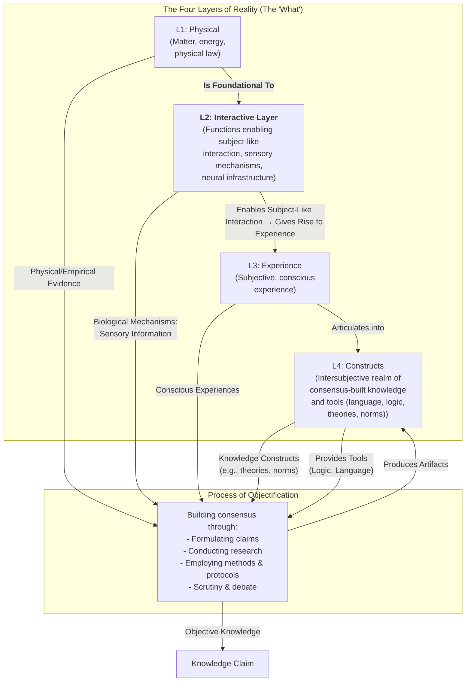

# 1. Introduction

I've always struggled to make sense of the diverse ways we come to know and understand the world. Initially, it seemed straightforward: I wanted to grasp why different fields, from physics to ethics, rely on distinct methods yet each claims its own form of objectivity. This framework addresses that by mapping reality into four distinct **Layers of Reality** (ontological realms that categorize where everything that exists resides, from physical matter to abstract constructs). These layers not only delineate the 'what' of existence but also illuminate the 'how' of achieving objectivity across them.

This framework is built on two core ideas. First, there are four fundamental **Layers of Reality**, which relate to each other in a filtering, hierarchical structure while remaining distinct realms of existence:

*   **Layer 1: Physical (L1):** The bedrock of mind-independent matter, energy, and physical law. This is the layer of mountains, moles, and molecules. It is the foundation for all other layers.
*   **Layer 2: Interactive Layer (L2):** This layer consists of the systems that enable subject-like interaction with the physical world (Layer 1), allowing entities to take in and process physical input in ways that inert matter cannot. It is the foundation for sensory mechanisms and neural infrastructure that actively engage with the environment, transforming L1's raw matter and energy into structured signals. This interactive process is what distinguishes L2 from the passive physical layer, powering the emergence of consciousness in Layer 3 by providing the necessary enablers for perception and response. For example, sensory systems here don't just exist; they allow dynamic interaction, like detecting and responding to light or sound from L1, which then gives rise to the felt experiences of L3. Non-biological analogs (e.g., robot sensors) may mimic this but are reducible to L1 and lack the subject-like interactive quality unless proven otherwise. We study this layer by observing how these systems function in interaction, highlighting their role as the bridge between physical reality and subjective experience.
*   **Layer 3: Experience (L3):** The first-person reality of subjective conscious experience (the "what it's like" quality of seeing red, feeling joy, or perceiving a flowing river). This layer is profoundly shaped by the biological; a beetle, a bull, and a human experience the same physical river in vastly different ways because their biological makeup (L2) acts as a unique filter. While we can connect reports to biological activity, a part of this experience remains, at present, irreducible (contingent on future scientific reduction; currently treated as distinct for evidential purposes).
*   **Layer 4: Constructs (L4):** The shared reality of intersubjective constructs that allow us to articulate and structure our thoughts through consensus formation and social constructions. This is where language, logic, mathematics, theories, and cultural norms exist.

Second, separate from these layers, there is the **Process of Objectification** (a human activity that forges knowledge by drawing evidence from any of the four layers and producing shareable artifacts, e.g., theories, norms, that reside in Layer 4). The standards of rigor and emphasis on tools shift depending on the source layer's nature, but the process allows for cross-layer integration to enhance applicability. For instance, in Layer 1 (physical), the process demands empirical discovery through observation and measurement, pointing to mind-independent phenomena for support. In Layer 3 (experience), it begins with articulating irreducible experiences (e.g., moral intuitions) logically and consistently, but can pull in evidence from lower layers (like biological insights on harm or historical patterns) to make a theory of morality more convincing and broadly applicable. This flexibility ensures that while each layer has its unique 'texture,' the process adapts without diminishing their ontological distinctness.

This model, visualized below (with a textual description for accessibility: The diagram shows Layer 1 foundational to Layer 2, which enables and constrains Layer 3, which articulates into Layer 4. All layers feed evidence (Physical from L1, Sensory from L2, Experiential from L3, Abstract from L4) into the separate Process of Objectification, which uses tools from Layer 4 to produce objective knowledge claims and artifacts that feed back into Layer 4. Layer 4 also provides tools like logic and language to the process.), resolves potential circularities by showing how Layer 4 houses the intersubjective artifacts produced by the process, while the process itself operates independently across all layers.

