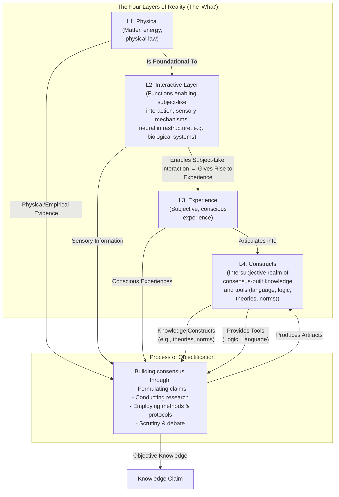

# 1. Introduction

I've always struggled to make sense of the diverse ways we come to know and understand the world. Initially, it seemed straightforward: I wanted to grasp why different fields, from physics to ethics, rely on distinct methods yet each claims its own form of objectivity. This framework addresses that by mapping reality into four distinct **Layers of Reality** (categories for where different kinds of things exist, from physical matter to abstract constructs). These layers show both what exists and how we achieve objectivity across different domains.

This framework is built on two core ideas. First, there are four fundamental **Layers of Reality**, which relate to each other in a filtering, hierarchical structure while remaining distinct realms of existence:

*   **Layer 1: Physical (L1):** The bedrock of mind-independent matter, energy, and physical law. This is the layer of mountains, moles, and molecules. It is the foundation for all other layers.
*   **Layer 2: Interactive Layer (L2):** The systems that enable entities to take in and respond to stimuli in ways inert matter cannot. A rock exists in L1; a system that detects light and converts it into signals *interacts* with L1. Biological sensory mechanisms and neural infrastructure are the clearest examples we have, but the layer is defined by the function, not the substrate. This active engagement with the environment is what separates L2 from L1 and what makes L3 (conscious experience) possible.
*   **Layer 3: Experience (L3):** The first-person reality of subjective conscious experience (the "what it's like" quality of seeing red, feeling joy, or perceiving a flowing river). This layer is profoundly shaped by the biological; a beetle, a bull, and a human experience the same physical river in vastly different ways because their biological makeup (L2) acts as a unique filter. While we can connect reports to biological activity, part of this experience can't currently be explained in purely physical terms. This might change as science advances, but for now we treat it as its own kind of evidence.
*   **Layer 4: Constructs (L4):** The shared reality of collectively-held constructs that allow us to articulate and structure our thoughts through consensus formation and social constructions. This is where language, logic, mathematics, theories, and cultural norms exist.

Second, separate from these layers, there is the **Process of Objectification**: a human activity that forges knowledge by drawing evidence from any of the four layers and producing shareable artifacts (theories, norms, etc.) that reside in Layer 4.

The standards of rigor shift depending on which layer supplies the evidence. Layer 1 (physical) demands empirical observation and measurement. Layer 3 (experience) begins with articulating experiences logically and consistently, but can pull in evidence from other layers to strengthen claims. For instance, a theory of morality might start from moral intuitions (L3) but incorporate biological insights about harm (L2) or historical patterns (L4) to become more convincing.

This flexibility means each layer keeps its distinct character while still contributing to shared knowledge.

This model, visualized below, avoids going in circles: Layer 4 holds the shared knowledge the process produces, but the process itself operates across all layers independently.

*Figure description: L1 is the physical foundation - matter, energy, space. Things that exist without actively engaging with anything. L2 is where systems actively engage with L1 - taking in stimuli (light, sound, pressure) and responding. We know this through biological examples like vision and touch, but the layer is defined by the capacity for interaction, not by biology. L3 emerges when an L2 system develops enough complexity to generate a subjective worldview - consciousness. L4 is what conscious beings create to make sense of everything - language, logic, theories, norms. These are shared tools for understanding, not the things themselves. The Process of Objectification connects to all layers: it draws evidence from each, uses tools from L4 (logic, language), and through research and debate, produces objective knowledge that feeds back into L4.*

The next section traces how we arrived at this framework by examining earlier theories and what they were missing. The section after that explores each layer in depth.