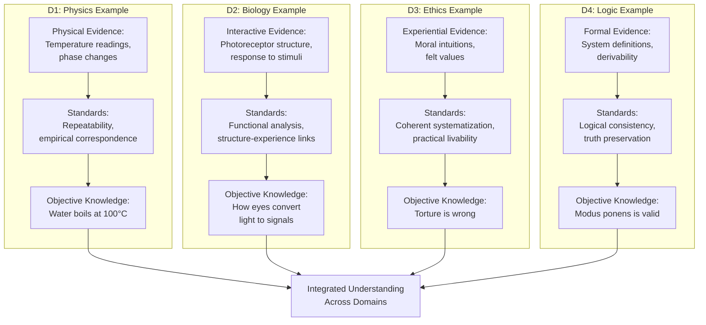

# 2. Examples of Domain-Specific Objectification

This section demonstrates how the Process of Objectification works differently depending on which domain supplies the primary evidence. Each example shows what counts as evidence, how that evidence is evaluated, and what standards determine whether a claim achieves objectivity.

## Domain 1 Example: Determining the Boiling Point of Water

Physics provides a clear case of D1-based objectification. The question is: at what temperature does water boil at sea level?

The process begins with empirical observation. Researchers heat water samples while measuring temperature with calibrated thermometers. They record when bubbles form throughout the liquid, indicating a phase transition from liquid to gas. Multiple trials are conducted across different locations at sea level, using different water sources and different measurement instruments.

The evidence is purely physical: temperature readings, observable phase changes, consistency across trials. The standards of rigor are empirical correspondence and repeatability. Does the measured temperature remain consistent? Do independent researchers get the same results? Can we predict when water will boil based on these measurements?

Through this process, we establish that water boils at 100°C (212°F) at sea level. This claim is objective because it corresponds to observable D1 phenomena, remains consistent across repeated trials, and enables reliable predictions. The objectification draws almost entirely from D1, with D4 providing only the tools (measurement systems, mathematical frameworks) to formalize and communicate findings.

## Domain 2 Example: Understanding How the Eye Detects Light

Neuroscience and biology study D2 systems. Consider the question: how do human eyes convert light into neural signals?

The process combines anatomical observation with functional testing. Researchers examine eye structure under microscopes, identifying photoreceptor cells (rods and cones) in the retina. They measure how these cells respond electrically when exposed to different wavelengths of light. They trace the pathway from photoreceptors through the optic nerve to the visual cortex. They study people with specific types of color blindness to understand how missing or malformed photoreceptors affect perception.

The evidence comes primarily from D2: observable structures of sensory organs, measurable responses to stimuli, functional relationships between biological components. The process also draws from D1 (physics of light, chemistry of photopigments) and connects to D3 (reports of what people actually see). The standards involve biological observation, functional analysis, and correspondence between structure and reported experience.

Through this process, we establish objective knowledge about how eyes work: photoreceptors contain photopigments that change shape when struck by photons, triggering electrical signals that travel through neural pathways. This claim is objective because it corresponds to observable D2 systems, explains functional behavior, and connects biological mechanisms to perceptual outcomes. The objectification is anchored in D2 while drawing supporting evidence from D1 and D3.

## Domain 3 Example: Evaluating the Wrongness of Torture

Ethics provides the clearest case of D3-based objectification. Consider the claim: torture is morally wrong.

The process begins with experiential evidence. People across cultures and contexts report intense moral intuitions against torture. The direct experience of suffering, the empathetic response to witnessing pain, the felt sense that deliberately inflicting agony violates something fundamental about human dignity, these form the primary evidence. We start with what people actually feel and value when confronted with torture.

The process then moves to systematization in D4. Moral philosophers construct frameworks that capture these intuitions: torture treats persons as mere means, it violates human rights, it causes extreme suffering without offsetting benefit. These frameworks must be logically coherent, handle edge cases consistently, and prove livable when applied to real situations. The theory is tested against moral judgments across many scenarios. Does it generate conclusions that match our considered convictions? Does it provide guidance for difficult cases? Can communities actually organize around these principles?

The process can incorporate evidence from other domains. D2 provides facts about the neuroscience of pain and trauma, showing the profound harm torture causes. D4 provides historical evidence about societies that permitted torture and the social dysfunction that resulted. D1 might constrain what counts as torture based on physical realities. Yet the primary evidence remains D3: what people experience and value matters morally.

Through this process, we establish that torture is objectively wrong. This claim is objective because it coherently systematizes widely shared moral intuitions, handles test cases well, incorporates relevant facts from other domains, and provides workable guidance for human communities. The objectivity looks different from physics, the standards differ, yet the claim is no less rigorous within its domain. The objectification is anchored in D3 while strengthened by insights from D2 and D4.

## Domain 4 Example: Establishing the Validity of Modus Ponens

Logic studies formal systems in D4. Consider the inference rule modus ponens: if P implies Q, and P is true, then Q is true.

The process works entirely within formal frameworks. Logicians define a system with symbols, formation rules, and inference rules. They establish axioms and derive theorems. The question becomes: does modus ponens preserve truth within this formal system?

The evidence is formal consistency and derivability. Can we prove within the system that whenever the premises are true, the conclusion must be true? Does accepting this rule lead to contradictions? Does it align with other inference rules we find useful? The standards are logical coherence, formal provability, and pragmatic utility in structuring arguments.

Through this process, we establish that modus ponens is a valid inference rule. This claim is objective because it follows from formal definitions, preserves truth within the system, and enables reliable reasoning. The objectification draws purely from D4, with the formal system itself providing both the object of study and the standards of evaluation. This creates no circularity because the content being studied (specific inference rules) differs from the tools being used (the formal system as a whole).

## How These Examples Fit Together

These examples show the same Process of Objectification operating across different domains. In each case, we formulate claims, gather appropriate evidence, apply domain-specific standards, and produce shareable knowledge. The differences lie in what counts as evidence and what standards apply.

Physics points to meter readings and repeatable observations. Biology observes functional systems and their responses. Ethics begins with moral experience and builds coherent frameworks. Logic works within formal systems according to defined rules. None is more objective than the others. Each is objective in the way appropriate to its domain.

The examples also show how domains can inform each other without reducing to each other. Understanding how eyes work (D2) helps explain why humans have certain perceptual experiences (D3), yet we cannot derive what it feels like to see red purely from anatomy. Moral philosophy (D3 systematized in D4) can incorporate biological facts about suffering (D2), yet we cannot derive moral conclusions purely from neuroscience. The domains maintain their distinct character while contributing to integrated understanding.

The diagram illustrates the parallel structure: each domain has its characteristic evidence, applies appropriate standards, and produces objective knowledge. These streams of knowledge can then integrate into comprehensive understanding that respects the distinct contributions of each domain.
