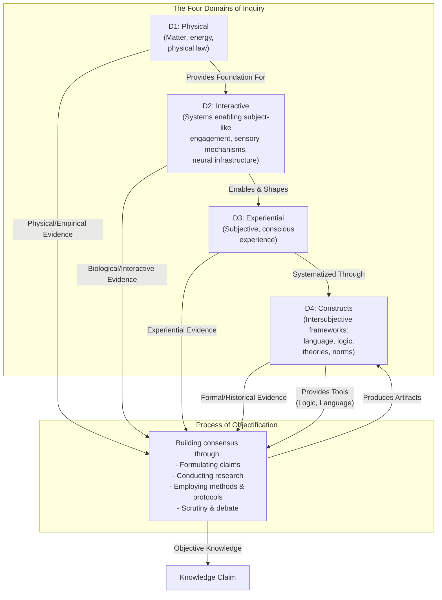

# 1. Introduction

I've always struggled to make sense of the diverse ways we come to know and understand the world. Initially, it seemed straightforward: I wanted to grasp why different fields, from physics to ethics, rely on distinct methods yet each claims its own form of objectivity. This framework addresses that challenge by identifying four distinct domains of inquiry and showing how each achieves objectivity through different types of evidence and standards of rigor.

The framework has two core components. First, there are four fundamental **Domains of Inquiry**, which organize how we gather and evaluate different types of evidence:

* **Domain 1: Physical (D1):** The study of mind-independent matter, energy, and physical law. This domain covers mountains, molecules, and fundamental forces. It provides the foundation for understanding all other domains.
* **Domain 2: Interactive (D2):** The study of systems that detect and respond to environmental stimuli. While we understand this domain primarily through biological examples like sensory organs and neural networks, the domain is defined functionally. These systems do more than undergo physical causation; they actively engage with their environment in ways that enable and constrain the possibility of consciousness.
* **Domain 3: Experiential (D3):** The study of first-person conscious experience, the subjective quality of seeing red, feeling joy, or perceiving a flowing river. This domain is profoundly shaped by D2 systems; a beetle, a bull, and a human experience the same physical river in vastly different ways because their interactive systems filter reality differently. For certain inquiries, particularly in ethics and aesthetics, first-person experience serves as the primary source of evidence.
* **Domain 4: Constructs (D4):** The study of collectively-held frameworks that allow us to articulate and structure understanding. This domain includes language, logic, mathematics, theories, and cultural norms. These constructs are intersubjective, meaning they depend on shared agreement and continuous refinement through discourse.

Second, there is the **Process of Objectification**: the ongoing human activity that forges knowledge by drawing evidence from any of the four domains and producing shareable artifacts that reside in D4. This process can be visualized as follows:

*Figure description: D1 is the physical foundation where matter, energy, and space exist. Things in this domain exist without actively engaging with anything. D2 is where systems actively engage with D1, taking in stimuli like light, sound, and pressure and responding to them. We know this domain through biological examples like vision and touch, but the domain is defined by the capacity for interaction itself. D3 emerges when D2 systems develop enough complexity to generate subjective experience. D4 contains what conscious beings create to make sense of everything: language, logic, theories, and norms. These are shared tools for understanding. The Process of Objectification connects to all domains, drawing evidence from each, using tools from D4 like logic and language, and through research and debate, producing objective knowledge that feeds back into D4.*

The standards of rigor shift depending on which domain supplies the primary evidence. Physics demands empirical observation and measurement of D1 phenomena. Ethics and aesthetics begin with D3 experiences like moral intuitions or aesthetic preferences, then construct formal theories in D4 that systematize those experiences. These theories can incorporate insights from other domains: biological facts about harm from D2, historical patterns from D4, physical constraints from D1. The flexibility allows each domain to maintain its distinct character while contributing to shared knowledge.

The key insight is that objectivity is domain-relative. Physics achieves objectivity through empirical correspondence with D1. Ethics achieves objectivity through coherent systematization of D3 intuitions informed by other domains. Neither approach is more or less objective; they are objective in different ways appropriate to their domains. This explains why different fields can use radically different methods while each legitimately claiming to produce objective knowledge.

The relationships between domains are methodological dependencies. Studying D2 requires understanding D1 first; you need physics to do neuroscience. Studying D3 requires understanding D2; investigating consciousness requires knowledge of brain systems. Formalizing D4 theories often systematizes D3 experiences. These dependencies reflect how we build knowledge, moving from simpler to more complex domains of inquiry.

The Process of Objectification operates across all domains. It uses D4 tools like logic and language. It draws evidence from whichever domain is relevant to the inquiry. Through research, debate, and consensus-building, it produces artifacts like scientific theories, moral frameworks, and aesthetic principles that become part of D4. These artifacts then have their own standing that we evaluate and refine through continued inquiry.

This framework provides a map for understanding how we come to know the world. It honors the unique character of different types of evidence while clarifying the shared, rigorous process by which we achieve objectivity across all domains of human inquiry.

The next section traces how we arrived at this framework by examining earlier theories and their limitations. The section after that explores each domain in depth.
