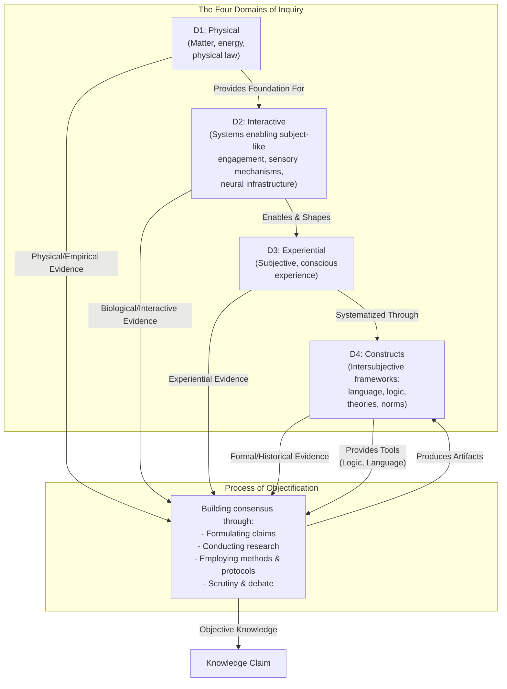

# 1. Introduction

I've always struggled to make sense of the diverse ways we come to know and understand the world. Initially, it seemed straightforward: I wanted to grasp why different fields, from physics to ethics, rely on distinct methods yet each claims its own form of objectivity. The puzzle deepened when I realized these fields succeed on their own terms. Physics produces reliable predictions about matter and energy. Ethics guides human conduct and social coordination. Aesthetics captures something real about human experience of beauty. Yet their methods differ dramatically. How can such different approaches all claim to produce objective knowledge?

This framework addresses that challenge by organizing inquiry into four distinct domains. Each domain involves different types of phenomena and requires different methodological approaches. The framework shows why methodological pluralism is necessary and how objectivity works differently across domains. Rather than forcing all knowledge into a single methodological mold, it honors the unique character of different types of evidence while clarifying the shared process by which we achieve objectivity.

The framework has two core components. First, there are four fundamental **Domains of Inquiry**, which organize how we gather and evaluate different types of evidence:

* **Domain 1: Physical (D1):** The study of mind-independent matter, energy, and physical law. This domain covers mountains, molecules, and fundamental forces. It provides the foundation for understanding all other domains.
* **Domain 2: Interactive (D2):** The study of systems that detect and respond to environmental stimuli. While we understand this domain primarily through biological examples like sensory organs and neural networks, the domain is defined functionally. These systems do more than undergo physical causation; they actively engage with their environment in ways that enable and constrain the possibility of consciousness. A rock exists in D1; a system that detects light and converts it into signals interacts with D1. This active engagement with the environment separates D2 from D1 and makes D3 (conscious experience) possible. The way these systems are structured determines what forms of consciousness are possible and what character that consciousness takes.
* **Domain 3: Experiential (D3):** The study of first-person conscious experience, the subjective quality of seeing red, feeling joy, or perceiving a flowing river. This domain is profoundly shaped by D2 systems; a beetle, a bull, and a human experience the same physical river in vastly different ways because their interactive systems filter reality differently. For certain inquiries, particularly in ethics and aesthetics, first-person experience serves as the primary source of evidence. When we evaluate moral theories or aesthetic judgments, we begin with what people actually experience, feel, and value. We can strengthen these theories by incorporating insights from other domains (biological facts about harm, historical patterns of social organization), yet the experiential evidence remains primary for these fields.
* **Domain 4: Constructs (D4):** The study of collectively-held frameworks that allow us to articulate and structure understanding. This domain includes language, logic, mathematics, theories, and cultural norms. These constructs are intersubjective, meaning they depend on shared agreement and continuous refinement through discourse. A logical system exists through shared acceptance of its rules. A scientific theory exists through collective evaluation and testing. These frameworks enable us to organize evidence from all other domains into shareable knowledge.

Second, there is the **Process of Objectification**: the ongoing human activity that forges knowledge by drawing evidence from any of the four domains and producing shareable artifacts that reside in D4. This process can be visualized as follows:

*Figure description: D1 is the physical foundation where matter, energy, and space exist. Things in this domain exist without actively engaging with anything. D2 is where systems actively engage with D1, taking in stimuli like light, sound, and pressure and responding to them. We know this domain through biological examples like vision and touch, but the domain is defined by the capacity for interaction itself. D3 emerges when D2 systems develop enough complexity to generate subjective experience. D4 contains what conscious beings create to make sense of everything: language, logic, theories, and norms. These are shared tools for understanding. The Process of Objectification connects to all domains, drawing evidence from each, using tools from D4 like logic and language, and through research and debate, producing objective knowledge that feeds back into D4.*

The standards of rigor shift depending on which domain supplies the primary evidence. When we study D1 (physics, chemistry), we demand empirical observation, measurement, repeatability, and predictive success. Claims must correspond to observable phenomena in the physical world. When we study D2 (neuroscience, optometry, biology), we observe how interactive systems function, how they respond to stimuli, how they enable organisms to engage with their environment. When we study D3 through ethics and aesthetics, we begin with what people actually experience, feel, and value, then construct formal theories in D4 that systematize those experiences. A moral theory succeeds when it coherently captures our considered moral judgments, handles edge cases well, and proves livable in practice. An aesthetic theory succeeds when it illuminates why certain works move us and provides useful frameworks for creation and appreciation. These theories can incorporate insights from other domains: biological facts about harm and flourishing from D2, historical patterns from D4, physical constraints from D1. The flexibility allows each domain to maintain its distinct character while contributing to shared knowledge. A physicist can point to meter readings; an ethicist must appeal to moral intuitions, logical consistency, and practical consequences.

This means that objectivity is domain-relative. The way things are objective is going to be organized differently, structured differently, depending on the domains used as foundations for objectification. Physics achieves objectivity through empirical correspondence with D1. Ethics achieves objectivity through coherent systematization of D3 intuitions informed by other domains. Aesthetics achieves objectivity through frameworks that capture and illuminate patterns in aesthetic experience. Neither approach is more or less objective; they are objective in different ways appropriate to their domains. This explains why different fields can use radically different methods while each legitimately claiming to produce objective knowledge. The mistake is thinking objectivity requires a single universal method. Objectivity means different things depending on what type of evidence you are organizing and what questions you are asking.

The relationships between domains are methodological dependencies. Studying D2 requires understanding D1 first; you need physics to do neuroscience. You need to understand how matter and energy work before you can understand how biological systems detect and respond to physical stimuli. Studying D3 requires understanding D2; investigating consciousness requires knowledge of the interactive systems that enable and shape it. We study how sensory organs work before we can understand how they give rise to particular forms of experience. Formalizing D4 theories often systematizes D3 experiences; moral philosophy takes moral intuitions and feelings and constructs coherent frameworks that guide action and resolve conflicts. These dependencies reflect how we build knowledge, moving from simpler to more complex domains of inquiry. The dependencies are not strict reduction, though. Ethics will never be just biology, even if biology informs ethics. The experiential evidence retains its methodological primacy for ethical inquiry.

The Process of Objectification operates across all domains and represents a different kind of entity than the domains themselves. The domains organize types of evidence and appropriate methodologies. The Process is the ongoing activity of using those methodologies to build knowledge. It uses D4 tools like logic and language. It draws evidence from whichever domain is relevant to the inquiry. A physicist investigating quantum mechanics draws primarily from D1. An ethicist constructing a theory of justice draws primarily from D3 while incorporating insights from D2 and D4. Through research, debate, and consensus-building, the Process produces artifacts like scientific theories, moral frameworks, and aesthetic principles that become part of D4. These artifacts then have their own standing that we evaluate and refine through continued inquiry. A moral framework, once constructed, becomes something we can study, critique, compare to alternatives, and test against new cases. This is why the Process sits outside the domains: it is the meta-activity that uses domain-specific methodologies to produce domain-transcendent knowledge.

This framework, visualized in the diagram above, avoids potential circularity by separating the domains from the process. D4 holds the shared knowledge the process produces (theories, logical systems, linguistic frameworks). The process itself operates across all domains independently, drawing evidence from each according to domain-appropriate standards. A logician studying formal systems treats logical structures in D4 as objects of inquiry, drawing evidence from that domain. A physicist studying matter treats D1 as the evidential domain. An ethicist begins with D3 but may strengthen claims by incorporating insights from D2 and D4. The process uses D4 tools (language, logic) while also producing D4 content (theories, norms), and this dual role creates no paradox because the tools and the content are distinct. Language-as-tool enables communication; language-as-content is what linguists study. Logic-as-tool structures arguments; logic-as-content is what logicians formalize.

What does this framework let you do? It lets you understand why seemingly incompatible ways of knowing can all be legitimate. You can see why physics textbooks look nothing like ethics papers, yet both produce real knowledge. You can evaluate claims by asking which domain they draw from and whether they use appropriate methods for that domain. You can spot when someone wrongly applies one domain's standards to another, like demanding empirical proof for aesthetic judgments or trying to derive moral conclusions purely from physics. You can see how fields can inform each other without reducing to each other. The framework gives you conceptual tools for making sense of the full landscape of human inquiry.

This framework provides a map for understanding how we come to know the world. It honors the unique character of different types of evidence while clarifying the shared, rigorous process by which we achieve objectivity across all domains of human inquiry. It shows why methodological pluralism is necessary, why different fields succeed with different standards, and how all of this fits together into a coherent picture of knowledge-building. The framework demystifies objectivity by showing it is not a single thing applied uniformly across all inquiry, yet it is still rigorous and meaningful within each domain.

The next section traces how we arrived at this framework by examining earlier theories and their limitations. The section after that explores each domain in depth.
